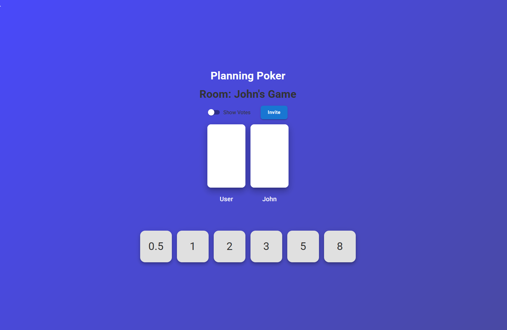

# Planning Poker App
A lightweight Planning Poker tool built with **React** (frontend) and **Spring Boot** (backend) using WebSockets for real-time communication.

## Features
- Create and join rooms
- Live user updates
- Submit, remove, reveal, and hide votes
- Persistent user sessions

## Tech Stack
- **Frontend:** React, React Router, React Query  
- **Backend:** Spring Boot (Java), WebSockets, Jackson  

## Getting Started
### Prerequisites
- Java 17+  
- Node.js 18+  
- npm  

### Run the backend
cd Planning-poker-back-end  
./gradlew bootRun  

### Run the frontend
cd react-planning-poker  
npm install  
npm start  

- Backend runs on **http://localhost:8080**  
- Frontend runs on **http://localhost:3000**  

## Routes
- `/` → Home  
- `/create-game` → Create a new room  
- `/invite/:roomID` → Join a room  
- `/planning-poker` → Poker board  

---
🚀 This project demonstrates full-stack development with **React + Spring Boot**, real-time WebSocket communication, and clean project structure.
